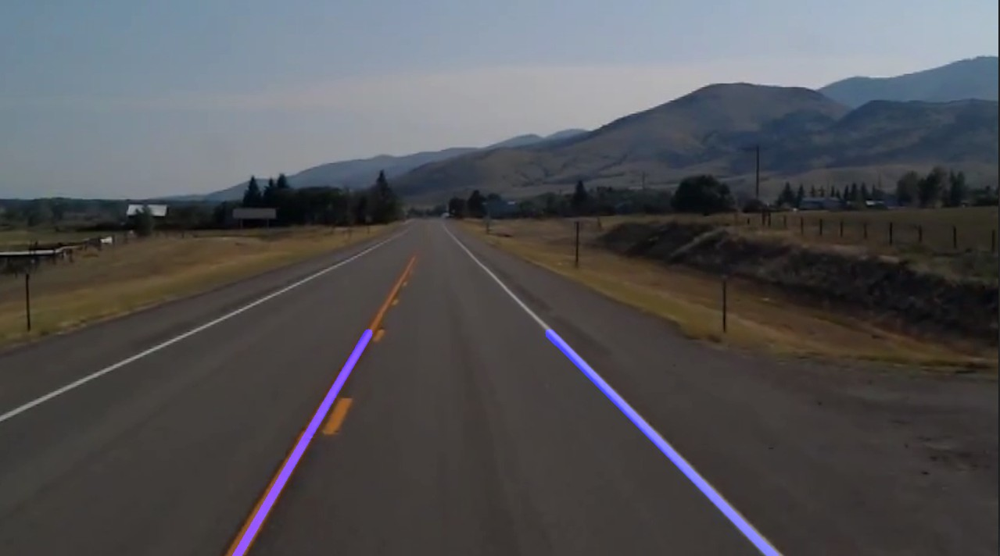

Lane Line Detection by a self driving car

The goal of this program is to make a lane lines detector from the video footage(or an image of the road) from a self driving car. It is basic and only uses Image Processing techniques to find lane line(no CNN).

     
     
Requirements:

Python 3
Numpy
OpenCV

Installations:

Python 3: Download python 3 from https://www.python.org/downloads/
Make sure you install python package index(pip) while you install python 3
Numpy : Execute the command “pip3 install numpy” in terminal/command prompt.
OpenCV : Execute the command “pip3 install opencv-python” in terminal/command prompt.

After installing all the required packages run the lane_lines.py file.
Change the path of the image in the code if the image could not be detected.

Result:

     
Future work:
     This code can be improved with the help of CNN and more training images.

